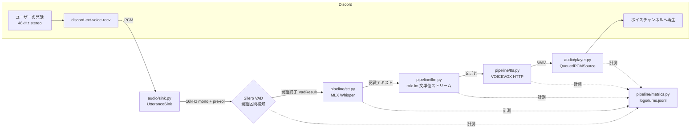
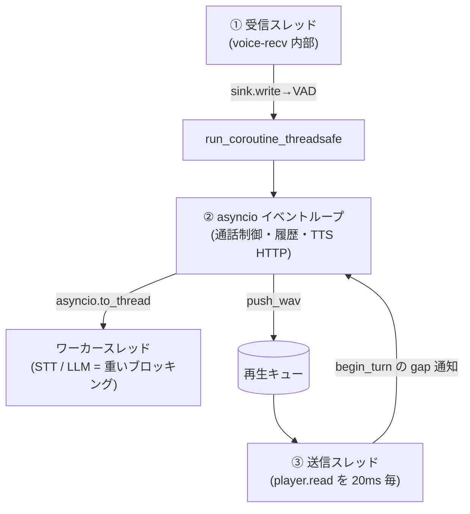

# アーキテクチャ解説 — discord_caller

Discord 上で「着信 → 応答するとボイスチャンネルでリアルタイム音声会話」を行う電話 Bot。
STT / LLM / TTS はすべて Mac ローカル(MacBook Air M3 / 8GB RAM 想定)で動く。
目標は**体感 1 秒前後の応答**。本ドキュメントは実装当時のコード構成を説明する。

- 経緯・意思決定・既知バグの背景は [HANDOFF.md](HANDOFF.md)
- セットアップ / 使い方は [README.md](README.md)
- ターンテイキングと今後の投機推論の設計メモは別途 turn-taking の学びメモを参照

---

## 1. 全体像



パイプラインは **STT → LLM → TTS → 再生** の直列だが、LLM は文の区切りごとに逐次
出力し、各文をすぐ TTS→再生へ流す。そのため「後続の文を生成・合成しながら、先頭の文を
再生する」という**文単位のパイプライン重なり**で体感遅延を抑えている。

---

## 2. コンポーネント

### `bot.py` — 起動時パッチと Discord ゲートウェイ
Apple Silicon + 実験的ライブラリ + Discord の E2EE 化に対応するため、起動時に 4 つの
パッチを当てる(詳細な背景は HANDOFF.md):

1. **libopus ロード**: Homebrew の libopus パスへフォールバックして `OpusNotLoaded` を回避。
2. **受信ループの耐障害化**: discord-ext-voice-recv は 1 パケットのエラーで受信ループ全体が
   止まるため、パケット単位の try/except に差し替える。
3. **DAVE 復号の注入**(最重要): Discord は 2026-03 にボイス E2EE(DAVE / MLS ベース)を必須化。
   ライブラリは DAVE 非対応で全パケットが壊れて見えるため、Opus デコード前に discord.py の
   `davey.DaveSession.decrypt()` を挟む。**discord.py の内部 API 依存で、ライブラリ更新で
   壊れやすい**。
4. **ログ抑制**: 受信エラーの大量ログ自体が CPU を食い遅延を悪化させるため抑制。

### `call_flow.py` — 通話ライフサイクルとパイプライン結線
`CallManager` が中核。状態機械 `CallState`:

```
IDLE → RINGING → AWAITING_JOIN → IN_CALL → (終了) → IDLE
```

- **着信**: Discord Bot API に実際の「通話」機能は無いため、DM の Embed + 「応答 / 拒否」
  ボタン(`IncomingCallView`)で**着信を擬似**する。応答後にユーザーが自分でボイスチャンネルへ入る。
- **モデルロード**(`load_models`): STT / LLM のロード(重いブロッキング)と TTS エンジンの
  起動確認を `asyncio.gather` + `asyncio.to_thread` で並行し、Bot 起動時間を延ばさない。
- **通話開始**(`_begin_call`): ボイスチャンネルへ接続 → `QueuedPCMSource` を `play()` →
  `UtteranceSink` を `listen()` → 挨拶を発話。
- **会話パイプライン**(`handle_utterance`): 下記スレッドモデルに従って STT→LLM→TTS を回す。

### `audio/sink.py` — 発話区間検知(「話している / 話していない」)
`UtteranceSink`(`voice_recv.AudioSink`)。`write()` はライブラリの**受信スレッド**から
同期的に呼ばれるので、ここでは重い処理をせず VAD 判定と発話バッファ追記だけを行う。

- 48kHz stereo 16bit → **16kHz mono float32** に間引き(`_resample_to_16k_mono`)。
- Silero `VADIterator` に **512 サンプル = 32ms** 単位で投入(閾値 `VAD_THRESHOLD=0.5`)。
- **発話開始**(`start` イベント)で `in_speech=True`、以降のフレームを `utterance` に蓄積。
- **pre-roll**: 未発話中の直近音声をリングバッファ(既定 `VAD_PRE_ROLL_MS=300ms`)に保持し、
  発話開始が確定した瞬間に発話先頭へ連結する。VAD が開始を検知するのは音が立ち上がった
  後なので、この先読みが無いと**語頭の子音が欠けて不自然**になる(間の自然さ対策)。
- **発話終了**の確定は 2 通り:
  - `end` イベント(= 無音が `VAD_MIN_SILENCE_MS=300ms` 継続)
  - `VAD_MAX_UTTERANCE_MS=15s` の強制打ち切り(溜め込み防止の安全弁)
- `VAD_MIN_SPEECH_MS=250ms` 未満は誤検出として破棄。
- 確定すると `VadResult`(PCM + 発話開始/終了時刻 + pre_roll_ms + ended_at_max)を作り、
  `asyncio.run_coroutine_threadsafe` でイベントループ側の `handle_utterance` を起動する。

> **ターンテイキングの核**: 現状は「無音が続いたら発話終了」という**沈黙タイマー方式**で、
> 推論は発話が終わってから初めて走る。ここが体感遅延と将来の投機推論の主戦場。

### `pipeline/stt.py` — 音声認識(MLX Whisper)
`whisper-small-mlx`。`mlx_whisper.transcribe()` はモデルをプロセス内キャッシュするため、
`__init__` で無音を 1 回文字起こしして**ウォームアップ**(初回の Metal JIT コストを通話前に払う)。
`condition_on_previous_text=False` で発話間の引きずりを防ぐ。実測 ~0.6s/発話。

### `pipeline/llm.py` — 応答生成(mlx-lm, 文単位ストリーム)
`Qwen2.5-1.5B-Instruct-4bit`。`stream_generate` のトークンを貯め、句点類(`。! ? ！ ？ \n`)が
来るたびに 1 文ずつ `yield` → すぐ TTS へ渡せる(体感遅延を下げる肝)。小型モデルは同語反復に
陥りやすいため、**repetition_penalty=1.3** + 末尾の反復パターン検知による**強制打ち切り**の
二段構えで保護。`__init__` でウォームアップ生成。実測 初文 0.5〜1.0s。

### `pipeline/tts.py` — 音声合成(VOICEVOX 互換 HTTP)
ローカル VOICEVOX ENGINE(既定 `127.0.0.1:50021`、話者=ずんだもん id 3)。
`/audio_query` → `/synthesis` の 2 段。`ensure_running()` はエンジン未起動時に**同梱 ENGINE
実行ファイルを直接ヘッドレス起動**(GUI 経由 `open -a` は Electron 起動で数分かかるため回避)。
VOICEVOX / AivisSpeech は API 互換で、`config.py` の URL/話者/バイナリパスの差し替えだけで
切替可能。実測 0.6〜0.75s/文。

### `audio/player.py` — 途切れない再生
`QueuedPCMSource`(`discord.AudioSource`)。discord.py の**送信スレッド**が 20ms ごとに
`read()` を同期呼び出しするので、ここでは一切ブロックせず、データが無ければ無音フレームを返す
(通話中ずっと同じ source で `play()` し続けられる)。文ごとの WAV は 48kHz stereo に変換して
キューに積み、順番に消費する。`begin_turn()` + `_report_playback_start()` で、**このターンの
応答が最初に鳴った瞬間**に発話終了からの経過を 1 回通知する(体感レイテンシの計測)。

### `pipeline/metrics.py` — ターン単位の計測(新規)
標準ライブラリのみの薄いロガー。1 ターン = 1 行の JSONL(`logs/turns.jsonl`)に、
**話し終わった瞬間(speech_end)を起点**とした各値を記録:

| フィールド | 意味 |
| --- | --- |
| `stt_ms` / `llm_first_sentence_ms` / `tts_first_chunk_ms` | 各段階の到達時刻(speech_end 起点) |
| `response_gap_ms` | **発話終了 → AI 音声が実際に鳴り始めるまで**(体感=間の直接指標) |
| `utterance_ms` / `pre_roll_ms` / `ended_at_max` | VAD が捉えた発話区間のメタ |
| `n_sentences` / `stt_text` | 応答の文数 / 認識結果(空 = 無音・幻聴で応答せず) |

`config.METRICS_ENABLED` で有効化。「速く・自然に」のチューニングを勘でなく実測で回すための起点。

---

## 3. スレッド / 並行モデル(重要)

3 つの実行文脈が絡む。取り違えるとハートビート停止や音飛びになる。



- **① 受信スレッド**: `sink.write()`。VAD 判定と追記のみ。重い処理は絶対に置かない。
- **② イベントループ**: 通話状態遷移、履歴管理、TTS の HTTP。ブロッキングな STT / LLM は
  `asyncio.to_thread` でワーカーへ逃がし、ループ(=ゲートウェイのハートビート)を止めない。
- **③ 送信スレッド**: `player.read()` を 20ms 周期で同期呼び出し。ここもブロック禁止。
- スレッド跨ぎは受信→ループが `run_coroutine_threadsafe`、送信→ループは `begin_turn` の
  コールバック(gap 通知)。計測のファイル追記は `TurnLogger` 内のロックで直列化。

---

## 4. レイテンシ予算(実測の目安)

| 段階 | 実測 | 備考 |
| --- | --- | --- |
| 発話終了検知の無音待ち | 300ms | `VAD_MIN_SILENCE_MS`(速さ↔分断の綱引き) |
| STT | ~0.6s | MLX Whisper small |
| LLM 初文 | 0.5〜1.0s | Qwen2.5-1.5B 4bit |
| TTS(1 文) | 0.6〜0.75s | VOICEVOX |
| **体感(発話終了→発声)** | **~1.5〜2s** | 目標 1s。`response_gap_ms` で実測する |

**ボトルネックの本質**: 応答パイプラインが発話終了後に直列で走り、終了検知自体も無音待ちを
含む。出力側は既に文単位ストリーム化済みなので、次に効くのは**入力側の投機化**
(発話中のストリーミング STT → 世代 ID で破棄・修正)。

---

## 5. 主な設定つまみ(`config.py`)

| 分類 | キー | 既定 | 効き方 |
| --- | --- | --- | --- |
| STT | `WHISPER_MODEL_REPO` | whisper-small-mlx | 精度↔速度/RAM |
| LLM | `LLM_MODEL_REPO` / `LLM_MAX_TOKENS` | Qwen2.5-1.5B-4bit / 120 | 品質↔速度 |
| LLM | `LLM_REPETITION_PENALTY` | 1.3 | 同語反復の抑制 |
| 履歴 | `HISTORY_TURNS` | 6 | 文脈量↔プロンプト長(遅延) |
| VAD | `VAD_MIN_SILENCE_MS` | 300 | 速さ↔発話途中での分断 |
| VAD | `VAD_PRE_ROLL_MS` | 300 | 語頭欠落防止(間の自然さ)。0 で無効 |
| VAD | `VAD_MIN_SPEECH_MS` / `VAD_MAX_UTTERANCE_MS` | 250 / 15000 | 誤検出破棄 / 溜め込み安全弁 |
| TTS | `TTS_ENGINE_BASE_URL` / `TTS_SPEAKER_ID` | localhost:50021 / 3 | エンジン・話者 |
| 計測 | `METRICS_ENABLED` / `METRICS_LOG_PATH` | True / logs/turns.jsonl | ターン計測 |
| 計測 | `LOG_LATENCY` | True | 標準出力への段階別ログ |

---

## 6. 既知の制約 / 脆さ

- **DAVE 復号パッチ**は discord.py 内部 API(`davey`)依存で、ライブラリ更新で壊れやすい。
- **discord-ext-voice-recv** は実験的(受信の耐障害化パッチ前提)。
- **1 対 1 専用**: `TARGET_USER_ID` 固定で、複数話者・複数人通話は非対応。
- **擬似着信**: Bot API に通話機能が無く、DM Embed + ボタンで代替。ユーザーが手動で入室する。
- **8GB RAM 前提**: 他の重いアプリは閉じる。TTS 自動起動は macOS 専用 + 初回 Gatekeeper 承認要。
- **割り込み(barge-in)未実装**: AI 発話中にユーザーが遮る経路は無い(toy-a 側に参考実装あり)。
- **入力側は非投機**: 推論は発話終了後に開始。ストリーミング STT / 終端予測は未実装。

---

## 7. ファイル早見

| 役割 | ファイル |
| --- | --- |
| 起動・パッチ・ゲートウェイ | `bot.py` |
| 通話状態機械・パイプライン結線 | `call_flow.py` |
| 発話区間検知(VAD)・pre-roll | `audio/sink.py` |
| 途切れない再生・gap 計測 | `audio/player.py` |
| STT / LLM / TTS | `pipeline/stt.py` / `pipeline/llm.py` / `pipeline/tts.py` |
| ターン計測ロガー | `pipeline/metrics.py` |
| 設定 | `config.py`(秘密は `.env`) |
