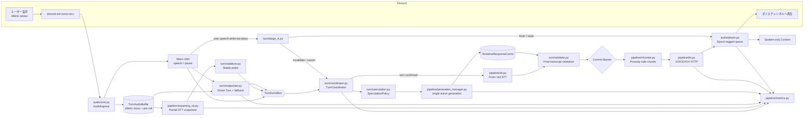
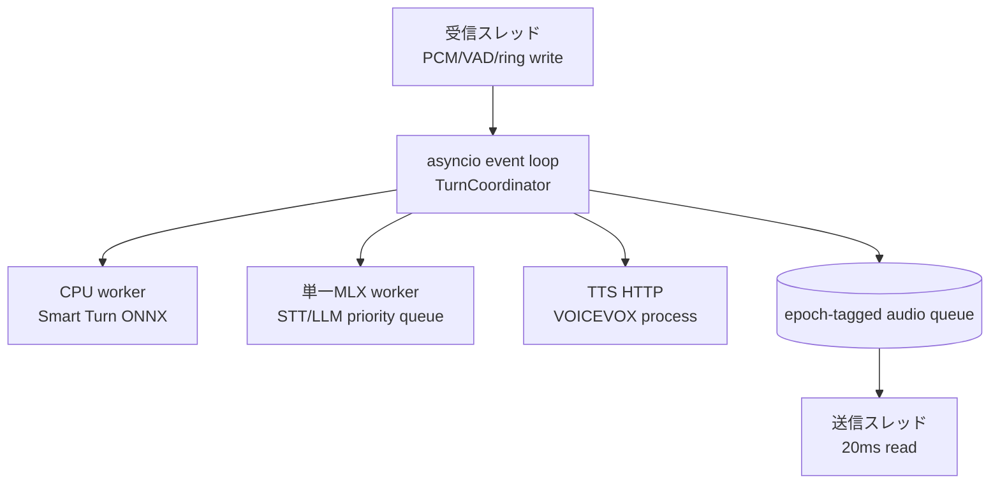
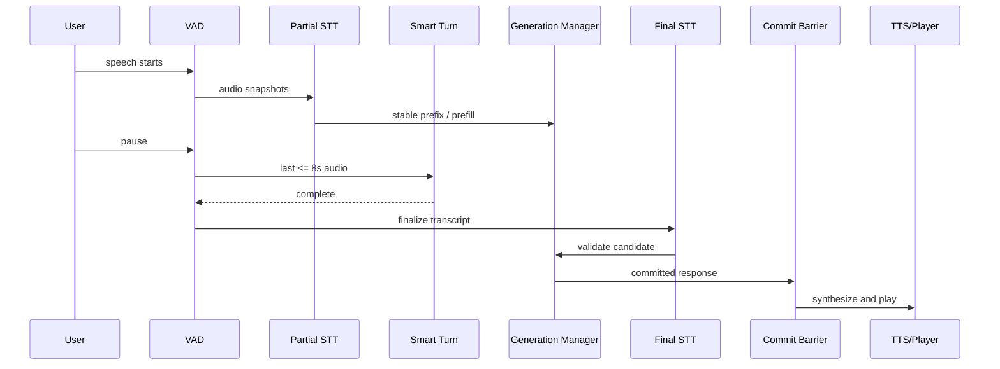
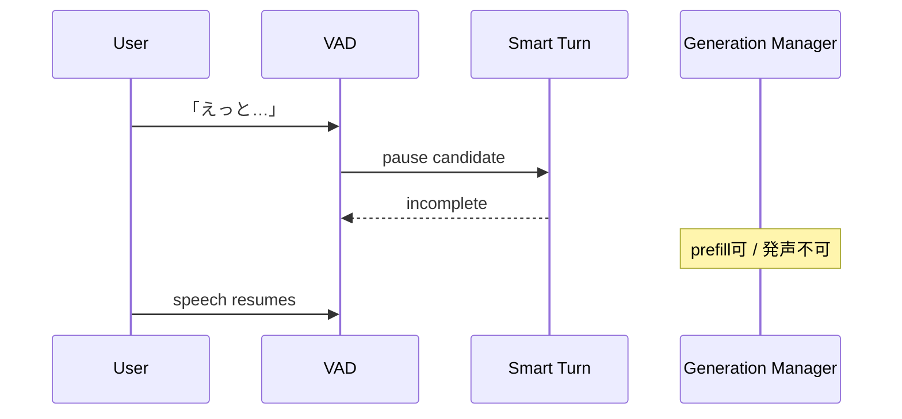
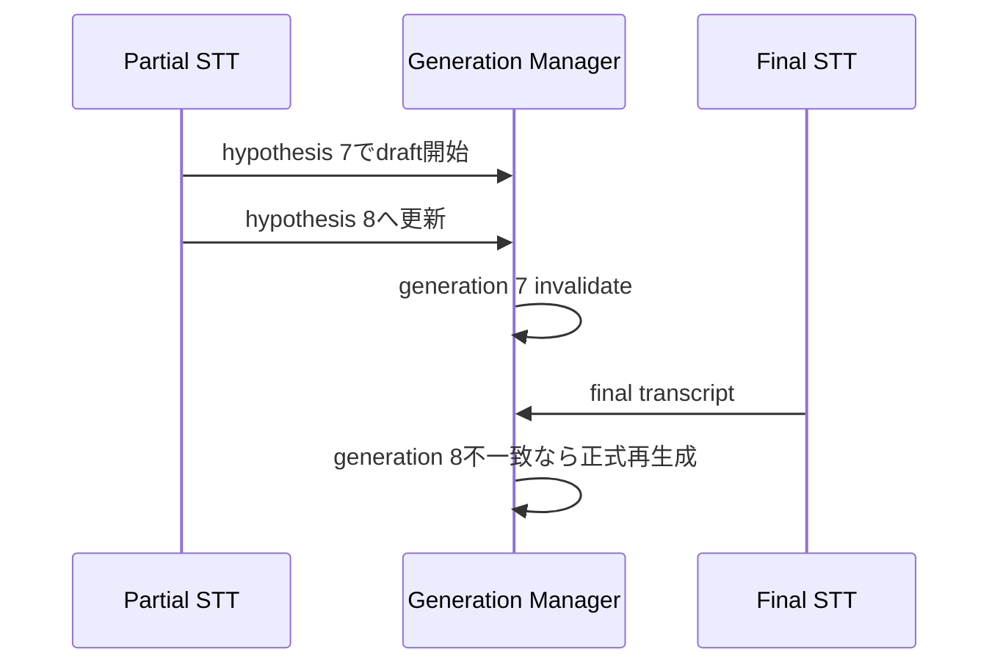
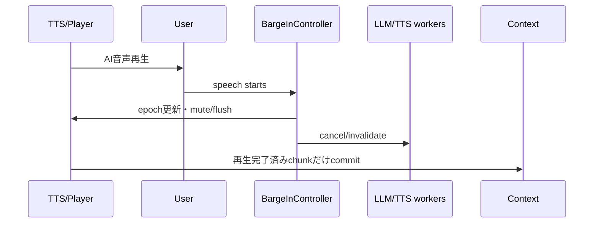

# アーキテクチャ改良提案 — discord_caller v2

> **状態**: 実装済み構成の説明ではなく、研究調査に基づく次期アーキテクチャ案。
> 現行 `ARCHITECTURE.md` は実装事実の記録として残し、本案を段階実装した後に統合する。
>
> **採用判断（確度94%）**: 現行の直列 `VAD → STT → LLM → TTS` を直接並列化するのではなく、
> **①ターン判定、②投機処理、③発声確定、④割り込み処理を分離したイベント駆動構成**へ移行する。

---

## 0. 目的の再定義

本プロジェクトの目的は「研究手法を多数搭載すること」ではない。

**目的は、MacBook Air M3 / 8GB RAM・全ローカルという制約下で、誤割り込みを増やさず、発話終了からAI音声開始までの時間を体感1秒前後へ近づけること**である。

評価対象は次の4点とする。

| 軸 | 目的 |
| --- | --- |
| 応答速度 | `response_gap_ms` のP50/P90を下げる |
| ターン精度 | 考え中の沈黙を発話終了と誤認しない |
| 割り込み | ユーザー発話時にAI音声と未再生キューを止める |
| 計算効率 | 8GB環境で投機処理が本処理を妨害しない |

### 非目標

- 音声対話基盤全体をPipecatやLiveKitへ移行すること
- 複数LLMを同時常駐させること
- 研究論文のモデルを一度にすべて導入すること
- 発話終了未確定のままAI音声を再生すること

---

## 1. 調査から確定した設計判断

### 1.1 研究・実装事例と採否

| 研究・実装 | 確認できた内容 | 本Botでの判断 |
| --- | --- | --- |
| [Smart Turn v3](https://github.com/pipecat-ai/smart-turn) | Silero等が一時停止を検出した時だけ、直近最大8秒の16kHz mono音声からターン完了/未完了を分類。日本語対応、CPU用int8は約8MB | **Phase 2で採用**。現行PCM形式と一致し、最小改修で導入可能 |
| [Incremental Processing + VAP, COLING 2025](https://aclanthology.org/2025.coling-main.249/) | 部分ASRごとに新しいLLM生成を起動する方式を実システム評価。応答間隔は短縮しても、不完全発話に基づく誤応答で主観評価・タスク成功が悪化 | **複数LLM同時生成を不採用**。単一世代・最新優先・Commit Barrierを必須化 |
| [LiveKit preemptive generation](https://docs.livekit.io/reference/agents/turn-handling-options/) | ターン確定前はLLMだけを先行し、TTS先行は既定で無効。発話時間と再試行回数にも上限 | **同じ安全側の既定値を採用**。`PREEMPTIVE_TTS=false` から開始 |
| [Pipecat interruptions](https://docs.pipecat.ai/pipecat/fundamentals/interruptions) | 割り込み時にLLM・TTS・未再生音声を一斉破棄し、会話履歴には実際に再生された範囲だけを残す | **Phase 1で最優先採用**。投機処理の前提となる安全機構 |
| [Endpoint Anticipation, 2026](https://arxiv.org/abs/2606.13450) | 発話終了を最大2.56秒前から予測し、LLM/TTSを投機実行。Unmute統合で平均505ms短縮、冗長計算28.4% | **Phase 6の実験**。真の先行推論だが、25Mモデル・Mimi特徴・英語中心学習のため初期採用しない |
| [Speculative End-Turn Detector, ACL 2026](https://aclanthology.org/2026.acl-long.2094/) | 軽量GRUで発話/非発話を追跡し、沈黙後にWav2vec系モデルでGap/Pauseを分類する二段推論 | **考え方だけ採用**。これは発話終了前のLLM先行ではなく、沈黙後のETD効率化 |
| [Whisper-Streaming](https://github.com/ufal/whisper_streaming) | WhisperにLocal Agreementと適応遅延を追加し、複数回の認識結果で共通部分を確定 | **安定接頭辞アルゴリズムを採用**。実装は現行MLX Whisperに合わせて簡略化 |
| [MLX-LM prompt cache](https://github.com/ml-explore/mlx-lm) | 共通プロンプトのKV状態を再利用可能 | **低リスク投機として採用候補**。応答生成より先に、履歴・部分入力のprefillを前倒しする |
| [Turn-taking survey, 2025](https://aclanthology.org/2025.iwsds-1.27/) | 調査対象の72%が既存手法と比較せず、標準ベンチマークも不足 | **ローカルA/B評価を必須化**。論文値だけで導入判断しない |

### 1.2 既存メモからの重要な訂正

#### 訂正A: SpeculativeETDの役割

誤解しやすい構図:

```text
軽量GRUが発話終了を先読み
  ↓
LLMを発話中に開始
```

実際の中心構造:

```text
100ms単位で軽量GRUが Speaking / Non-speaking を追跡
  ↓
沈黙が発生
  ↓
重い分類器が Gap（終了） / Pause（継続）を判定
```

したがって、SpeculativeETDは**発話終了前投機の中核ではなく、沈黙後エンドポイント判定の省計算化**として扱う。

#### 訂正B: 低遅延化と自然さは同じではない

部分ASRからLLMを大量に並行起動すると、間は短くできても、不完全入力に基づく誤回答が増える。

本Botでは次の原則を固定する。

```text
推論開始は早めてよい
TTS合成は条件付きで早めてよい
再生はターン確定後だけ
```

#### 訂正C: Smart TurnはVADの代替ではない

Smart Turnは連続的な音声区間検知ではない。

```text
Silero VAD: 音声が止まったことを検出
Smart Turn: その停止が「考え中」か「発話終了」かを分類
```

現行Silero VADは残し、役割を「終了確定」から「一時停止トリガー」へ変更する。

---

## 2. v2全体像



### 中核原則: 3つの境界を分離する

| 境界 | 意味 | 誤判定時の被害 |
| --- | --- | --- |
| Pause Boundary | 音声が一時的に止まった | Smart Turnを余分に1回実行するだけ |
| Reasoning Boundary | 部分入力で推論を始めてよい | 投機計算を破棄するだけ |
| Audible Commit Boundary | AI音声をユーザーへ流してよい | 誤割り込みとして体験を壊す |

**Reasoning BoundaryとAudible Commit Boundaryを同一にしないことがv2の最重要不変条件。**

---

## 3. ターン状態モデル

巨大な単一状態機械を作ると、入力状態と出力状態の組合せが爆発する。
そのため2つの直交状態として管理する。

### 3.1 UserTurnState

```text
SILENT
  ↓ SpeechStarted
SPEAKING
  ↓ PauseDetected
PAUSE_CANDIDATE
  ├─ SpeechResumed → SPEAKING
  └─ TurnConfirmed → ENDED
```

### 3.2 AssistantTurnState

```text
IDLE
  ↓ speculative work
PREFILLING / DRAFTING
  ↓ candidate ready
READY
  ↓ commit
PLAYING
  ↓ user interruption
INTERRUPTED
  ↓ cleanup
IDLE
```

### 3.3 ID体系

すべての非同期成果物に次のIDを付ける。

| ID | 更新条件 | 用途 |
| --- | --- | --- |
| `call_id` | 通話開始 | 通話を跨いだ結果混入を防止 |
| `turn_id` | ユーザー発話開始 | 1ユーザーターンを識別 |
| `hypothesis_id` | 部分STTが更新 | 古い認識仮説を破棄 |
| `generation_id` | LLM投機を開始 | 古いLLM出力を破棄 |
| `playback_epoch` | 発声開始・割り込み | 古いWAVが再生されることを防止 |

受信側は必ず、現在IDと一致しない結果を副作用なしで捨てる。

---

## 4. コンポーネント詳細

### 4.1 `audio/sink.py` — AudioIngressへ縮小

現行の重要原則「受信スレッドで重い処理をしない」は維持する。

担当:

- 48kHz stereo → 16kHz mono変換
- 32msフレーム単位のSilero VAD
- 300ms pre-roll
- `TurnAudioBuffer` への追記
- `SpeechStarted` / `PauseDetected` / `SpeechResumed` の発行
- AI再生中の `SpeechStarted` をBarge-inへ通知

非担当:

- 発話終了確定
- STT実行
- Smart Turn実行
- LLM開始判断

#### 意味変更

旧:

```text
300ms無音 = 発話終了
```

新:

```text
200ms前後の無音 = PauseCandidate
PauseCandidate + SmartTurn / fallback = 発話終了確定
```

`VAD_MIN_SILENCE_MS` は廃止または互換設定とし、`VAD_PAUSE_TRIGGER_MS` へ意味を分離する。

---

### 4.2 `audio/ring_buffer.py` — TurnAudioBuffer

1ターン分の音声を保持し、複数処理がコピーを増やさず参照できるようにする。

保持内容:

```text
pre-roll 300ms
+ current turn PCM
+ monotonic timestamps
+ pause positions
```

API例:

```python
snapshot(turn_id, end_sample=None) -> AudioSnapshot
last_ms(turn_id, 8000) -> AudioSnapshot
finalize(turn_id) -> FinalizedAudio
```

不変条件:

- `sink.write()` から長時間ロックしない
- 8秒を超えるSmart Turn入力は先頭を切り、直近8秒を渡す
- 評価用PCM保存は明示設定時だけ行う

---

### 4.3 `turn/events.py` — 型付きイベント

イベントループへ渡す値を統一する。

```text
SpeechStarted
AudioProgress
PauseDetected
SpeechResumed
PartialTranscriptUpdated
StablePrefixUpdated
TurnCompletionPredicted
TurnConfirmed
SpeculationStarted
SpeculationInvalidated
ResponseCandidateReady
PlaybackCommitted
BargeInDetected
PlaybackStopped
```

すべてに `call_id`, `turn_id`, `monotonic_ns` を含める。

部分STTイベントは無制限キューへ積まない。
`LatestValueSlot` またはサイズ1のキューで古い仮説を上書きする。

---

### 4.4 `turn/endpointer.py` — Endpointer Chain

共通インターフェース:

```python
class Endpointer(Protocol):
    async def on_pause(self, audio: AudioSnapshot) -> EndDecision: ...
```

#### Stage A: SmartTurnEndpointer

初期採用。

```text
Sileroが約200msの停止を検出
  ↓
直近最大8秒をSmart Turn v3 CPU int8へ
  ↓
COMPLETE   → TurnConfirmed
INCOMPLETE → 聞き続ける
```

Smart Turnが未完了を返しても、無限待機させない。
`TURN_FORCE_END_MS` を超えた継続沈黙で終了へフォールバックする。

#### Stage B: SilenceFallbackEndpointer

以下の場合だけ使用する。

- Smart Turnモデル未ロード
- 推論タイムアウト
- 例外
- 無音が強制終了閾値を超過

#### Stage C: EndpointAnticipator（将来実験）

これは終了確定器ではなく、**投機開始信号だけを出す**。

```text
AnticipationSignal(horizon_ms, confidence)
  ↓
SpeculationPolicy
```

Endpoint Anticipator単独で `TurnConfirmed` を発行してはならない。

---

### 4.5 `pipeline/streaming_stt.py` — Snapshot型Incremental STT

Whisperは本来ストリーミングASRではないため、初期実装は「一定間隔で全文を盲目的に再認識」しない。

#### 適応スケジュール

部分認識を起動する候補:

- 発話開始後、十分な音声が溜まった
- 前回認識から一定量の新規音声が追加された
- PauseCandidateが発生した
- MLX高優先度処理が空いている

抑制条件:

- 直前の部分STTがまだ実行中
- final STTまたは確定LLMが待機中
- 同一ターンの上限回数を超えた
- 発話が長時間化し投機価値が低い

#### Local Agreement簡易版

日本語は空白分割に依存しないため、Unicode正規化後の文字列またはtoken列で共通接頭辞を求める。

```text
snapshot 1: 明日の東京の天気を
snapshot 2: 明日の東京の天気を教えて
snapshot 3: 明日の東京の天気を教えてください

stable:     明日の東京の天気を
unstable:                         教えてください
```

`stable_prefix` は「直近2回以上で一致した部分」とする。
最終STTだけが正本であり、部分STTは常に仮説である。

---

### 4.6 `turn/stabilizer.py` — PartialTranscriptStabilizer

出力:

```python
StableTranscript(
    stable_prefix: str,
    unstable_suffix: str,
    stability_passes: int,
    covered_audio_end_ms: int,
    hypothesis_id: int,
)
```

初期投機条件の候補値:

```text
stable_prefix >= 12日本語文字
AND 直近2回で一致
AND 前回投機から300ms以上
AND turn中の投機回数 <= 2
```

これは固定仕様ではなく、評価データで調整する初期値。

#### Continuation Guard

次のような末尾では、応答ドラフト生成を抑制し、prefillまでに留める。

```text
けど / が / ので / から / し / て / なら / たら / というか
いや / 違う / やっぱり / じゃなくて
```

理由: 日本語は発話末尾の否定・修正・接続で意図が反転しやすい。

---

### 4.7 `turn/speculation.py` — 段階的SpeculationPolicy

投機を一種類にしない。

| Level | 処理 | 安全性 | 初期設定 |
| --- | --- | --- | --- |
| S0 OFF | 何もしない | 最高 | フォールバック |
| S1 PREFILL | 履歴＋安定部分入力のKV cacheだけ計算 | 高 | **有効候補** |
| S2 DRAFT_TEXT | 最大10〜16token程度の応答冒頭を生成し、再生せず保持 | 中 | Phase 4で有効化 |
| S3 PRE_SYNTH | 応答冒頭をTTS合成し音声キャッシュ | 低〜中 | 初期は無効 |

#### Policy入力

- 安定接頭辞の長さ・一致回数
- PauseCandidate / Smart Turn結果
- 将来のEndpoint Anticipation信号
- 発話継続時間
- continuation risk
- MLXキュー長・メモリ圧力
- 当該ターンの投機回数

#### 既定ポリシー

```text
通常発話中                    → S0またはS1
安定接頭辞あり                 → S1
PauseCandidate + 高い完了可能性 → S2
TurnConfirmed                  → 正式生成または候補検証
S3                              → 評価で安全性確認後のみ
```

---

### 4.8 `pipeline/prompt_cache.py` — 低リスクの先行推論

投機生成より先に、prompt prefillを前倒しする。

キャッシュ階層:

```text
ConversationPrefixCache
  = system prompt + 確定済み会話履歴

TurnPrefixCache
  = ConversationPrefixCache + stable user prefix
```

発話終了時:

```text
最終transcriptがstable prefixをtoken単位で保持
  → suffixだけprefillして正式生成

prefixが崩れた
  → ConversationPrefixCacheから最終transcriptを再prefill
```

正しさはキャッシュに依存させない。
キャッシュ再利用に失敗した場合でも、通常生成へ必ず戻れる構造にする。

MLX-LMのprompt cacheはバージョン差・モデルアーキテクチャ差があるため、
`PromptCacheAdapter` の背後へ隔離し、Qwen2.5でtoken一致の回帰テストを行う。

---

### 4.9 `pipeline/generation_manager.py` — 単一世代・Latest Wins

M3 / 8GBでは、部分ASRごとに複数LLMを並行実行しない。

```text
active_generation: 1個だけ
queued_speculation: 最新1個だけ
old hypothesis: 即破棄
```

API例:

```python
start_prefill(turn_id, hypothesis_id, prompt) -> generation_id
start_draft(turn_id, hypothesis_id, prompt, max_tokens=16) -> generation_id
invalidate(generation_id, reason)
commit_or_regenerate(final_transcript)
```

#### キャンセルの現実的な扱い

`asyncio.Task.cancel()`だけで、`to_thread`内部のMLX処理が必ず停止するとは限らない。
そのため二層で守る。

1. `CancellationToken` をtoken生成ループで確認し、可能な場所で停止
2. 停止できなかった結果も `generation_id` 不一致で破棄

古い世代のtoken・TTS・WAVが後段へ到達しても、ID検査で副作用を起こさない。

---

### 4.10 `turn/validator.py` — Final Transcript Validator

初期版では安全側に倒す。

#### v1: Strict Validator

候補応答を再利用する条件:

- 最終transcriptと投機snapshotが、句読点・フィラー等の許可差分を除き一致
- `turn_id`, `hypothesis_id`, `generation_id` が現行
- late correction markerがない

一致しなければ、候補は破棄して正式生成する。

#### v2: Prefix-aware Validator

ログから安全性が確認できた後、次を許可する。

- 最終入力が投機入力の安全な拡張
- 意図分類が変化していない
- 否定・修正・対象語の変更がない

「意味的に似ている」だけで再利用しない。誤回答の被害が遅延短縮より大きいためである。

---

### 4.11 `turn/commit_barrier.py` — 発声の最終関門

次の条件をすべて満たすまでPLAYERへWAVを送らない。

```text
TurnConfirmed
AND final transcript ready
AND generation current
AND response validated
AND playback_epoch current
AND not interrupted
```

投機済みTTS音声も `TentativeAudioCache` に置くだけで、Commit Barrier通過前には再生しない。

---

### 4.12 `pipeline/chunker.py` — Prosody-safe Chunker

現行は文末句読点まで待ってからTTSへ送る。
初動を短縮するため、文より短い「意味・韻律が壊れにくい節」へ分割する実験を追加する。

分割候補:

- `。！？` は常に境界
- `、` は一定文字数を超えた場合だけ境界
- 最大文字数到達時も、助詞・数値・英単語の途中では切らない
- 最初のchunkは短め、以後は長め

注意:

- 細かすぎる分割はVOICEVOXの抑揚を壊す
- HTTP呼び出し回数が増える
- 実測で初回合成時間と自然さを同時評価する

---

### 4.13 `audio/player.py` — Epoch-tagged Queue

WAVキュー要素:

```python
AudioChunk(
    call_id,
    turn_id,
    generation_id,
    playback_epoch,
    chunk_id,
    text,
    pcm,
)
```

`read()` は20msごとに現在epochを確認し、古いchunkを無音化・破棄する。

追加API:

```python
pause_for_interruption()
resume_after_false_interruption()
flush_epoch(epoch)
report_chunk_started()
report_chunk_completed()
```

再生済み文脈は「生成済み」ではなく「再生完了済みchunk」から構築する。
途中で切れたchunkは、初期版では会話履歴へ全文を入れない。

---

### 4.14 `turn/barge_in.py` — 割り込みを第一級イベント化

現行の未実装項目だが、投機処理より先に必要。

初期挙動:

```text
AI再生中にユーザーのspeech start
  ↓
短い確認窓でノイズを除外
  ↓
playback_epochを更新
  ↓
LLM/TTSをinvalidate
  ↓
未再生WAVをflush
  ↓
新しいuser turnへ移行
```

将来の二段割り込み:

```text
短い「うん」「はい」 = backchannelとしてAI継続
訂正・質問・長い発話 = hard interruption
```

初期版では分類を複雑化せず、短時間閾値とSTT有無で調整する。

#### 会話履歴

割り込み後に保存するassistant発話:

```text
完全に再生済みchunkだけ
+ interrupted=true
```

未再生のLLM出力を履歴へ入れない。

---

## 5. 並行・スレッド・資源モデル

### 5.1 実行文脈



### 5.2 単一MLX Lane

STTとLLMはApple Siliconの統合メモリ・GPU資源を共有する。
投機処理導入後に無制限な `asyncio.to_thread` を使うと、最終STTと投機LLMが競合する。

既定:

```text
MLX_CONCURRENCY = 1
```

優先順位:

| 優先 | Work |
| ---: | --- |
| 0 | final STT |
| 1 | committed LLM generation |
| 2 | pause直前のpartial STT |
| 3 | speculative draft / prefill |
| 4 | background warmup / eval |

新しい高優先度jobが来た場合、未開始の低優先度jobは削除する。
実行中jobはCancellationTokenで停止を試み、停止不能でも結果を破棄する。

### 5.3 CPUとMLXの分離

Smart Turn CPU int8は、MLX workerとは別workerで実行する。
ただしCPU負荷でDiscord受信が崩れないよう、worker数は1から開始する。

### 5.4 Backpressure

- 音声フレーム: ring buffer
- 部分STT要求: 最新1件へcoalesce
- 投機LLM要求: 最新1件へcoalesce
- TTS: committed chunkのみbounded queue
- WAV: 最大秒数を超えたら生成側を待たせる

「遅れて届いた処理を全部実行する」のではなく、「古くなった処理を捨てる」。

---

## 6. ターン処理シーケンス

### 6.1 通常ターン



### 6.2 考え中の間



### 6.3 投機失敗



### 6.4 Barge-in



---

## 7. 計測設計

現行 `response_gap_ms` は維持し、投機とターン判定の因果を追える値を追加する。

### 7.1 Timing

| フィールド | 意味 |
| --- | --- |
| `speech_start_ns` | ユーザー発話開始 |
| `last_voice_ns` | 実音声が最後に観測された時刻 |
| `pause_detected_ns` | VADが一時停止を検出 |
| `turn_confirmed_ns` | Smart Turn/fallbackが終了確定 |
| `partial_stt_first_ns` | 最初の部分認識 |
| `stable_prefix_ns` | 投機条件を満たした時刻 |
| `speculation_started_ns` | prefill/draft開始 |
| `first_audio_played_ns` | AI音声が実際に開始 |
| `response_gap_ms` | `last_voice → first_audio_played` |
| `decision_delay_ms` | `last_voice → turn_confirmed` |

### 7.2 Speculation

| フィールド | 意味 |
| --- | --- |
| `speculation_level` | S0/S1/S2/S3 |
| `speculation_lead_ms` | 発話終了より何ms前に開始したか |
| `usable_lead_ms` | 実際に短縮へ転換できた時間 |
| `commit_rate` | 投機候補を再利用できた割合 |
| `cancel_rate` | 投機候補を破棄した割合 |
| `cancel_reason` | transcript_changed / barge_in / resource / timeout等 |
| `wasted_compute_ms` | 破棄された処理時間 |
| `wasted_tokens` | 破棄token数 |
| `speculation_attempts` | 1ターンの試行回数 |

### 7.3 Turn-taking / Barge-in

| フィールド | 意味 |
| --- | --- |
| `endpointer_source` | smart_turn / silence / max_duration |
| `pause_count` | 1ターン内の一時停止数 |
| `false_cut` | 後続発話がすぐ続いた終了誤判定 |
| `barge_in_detect_ms` | ユーザー発話開始から割り込み確定 |
| `barge_in_stop_ms` | ユーザー発話開始からAI音声停止 |
| `false_interruption` | ノイズ・短い相槌で停止したか |
| `played_chunks` | 完全再生chunk数 |
| `dropped_audio_ms` | 割り込みで捨てた未再生音声 |

### 7.4 Recognition quality

| フィールド | 意味 |
| --- | --- |
| `partial_final_cer` | 部分認識と最終認識の文字誤り率 |
| `stable_prefix_coverage` | 最終文の何%が事前確定したか |
| `late_correction_detected` | 最終部で否定・修正が入ったか |
| `response_regenerated` | 最終入力により再生成したか |

すべて `time.monotonic_ns()` を基準にし、壁時計変更の影響を受けないようにする。

---

## 8. 評価プロトコル

### 8.1 Replay Harness

実会話だけで調整すると再現性がないため、PCMと正解ラベルを再生できるテストハーネスを作る。

```text
recorded PCM
+ speech/pause/end ground truth
+ final transcript
+ scenario label
  ↓
現行v1とv2を同じ入力で実行
  ↓
JSONLを比較
```

### 8.2 日本語シナリオ

最低限、次を分離して評価する。

| 分類 | 例 |
| --- | --- |
| 明確な終了 | 「明日の天気を教えて。」 |
| 短い逡巡 | 「明日の……天気を」 |
| 長い逡巡 | 500ms / 1000ms沈黙後に継続 |
| フィラー | 「えっと、あの」 |
| 接続終わり | 「調べてほしいんだけど」 |
| 自己修正 | 「東京、いや横浜の」 |
| 遅い否定 | 「それでいい、わけではない」 |
| 短答 | 「はい」「違う」 |
| 雑音 | 咳、机音、キーボード |
| Barge-in | AIの文中で訂正・質問 |
| Backchannel | AI発話中の「うん」「なるほど」 |
| 長発話 | 10秒超 |

### 8.3 初期Go / No-Go基準

数値は製品仕様ではなく、比較実験を止めないための初期判定値。

| 指標 | 初期基準 |
| --- | ---: |
| stale epochの音声再生 | **0件** |
| 発話未確定での再生 | **0件** |
| `false_cut_rate` | baseline以下 |
| `barge_in_stop_ms` | P95 200ms以下を目標 |
| `commit_rate` | 70%以上でS2継続検討 |
| `wasted_compute_ratio` | 30%以下を目標 |
| 応答内容の正確性 | baselineを下回らない |
| `response_gap_ms` | Phaseごとに有意な改善 |

`turns.jsonl` と音声サンプルが未提供のため、現時点で改善幅の確定値は出さない。

---

## 9. 段階導入

### Phase 0 — Baseline固定

実装:

- 現行100〜200ターンの `turns.jsonl` を収集
- `last_voice_ns` と `first_audio_played_ns` を明確化
- Replay Harness作成
- 既存の1.5〜2秒という目安を実測分布へ置換

完了条件:

- P50/P90、false cut、空STT率を再現可能

### Phase 1 — Cancellation / Barge-in基盤

実装:

- `turn_id`, `generation_id`, `playback_epoch`
- epoch付きWAVキュー
- `flush_epoch()`
- LLM/TTS cancellation token
- 再生済みchunkだけを会話履歴へcommit

効果:

- 応答速度はほぼ変わらない
- 以降の投機処理が古い音声を漏らさない

**投機処理より先に完了させる。**

### Phase 2 — Smart Turn

実装:

- `VAD_PAUSE_TRIGGER_MS` を導入
- Smart Turn v3 CPU int8
- complete/incomplete判定
- timeout・強制沈黙fallback

効果:

- 考え中の300ms沈黙を切る問題を減らす
- 単独では1秒目標を達成しない

### Phase 3 — Partial STT Observer

実装:

- 部分STT snapshot
- Local Agreement / stable prefix
- final transcriptとのCER計測
- **LLMはまだ開始しない**

完了条件:

- 安定接頭辞が何ms前に得られるかを把握
- 8GB環境で音飛び・Discord heartbeat停止なし

### Phase 4 — S1 Prefill / S2 Draft

実装:

- ConversationPrefixCache
- Generation Manager
- 最大2回の投機
- Strict Validator
- preemptive TTSは無効

有効化条件:

- stable prefixの信頼度が十分
- 投機によりfinal STTが遅くならない
- 応答正確性がbaseline以上

### Phase 5 — Chunking / Tentative TTS

実装:

- Prosody-safe Chunker
- S3 PRE_SYNTHを実験フラグで追加
- 音声はCommit Barrierまで再生禁止

有効化条件:

- S2 commit率70%以上
- TTS事前合成の無駄が許容範囲
- 韻律評価がbaselineを下回らない

### Phase 6 — Endpoint Anticipation / VAP

比較:

- Smart Turnのみ
- VAP
- Endpoint Anticipation

導入条件:

- 日本語replayデータでSmart Turnより明確に改善
- 25Mモデルと特徴抽出が8GB環境で本処理を妨害しない
- 冗長計算を30%前後以下へ制御可能

---

## 10. 設定案

```python
# Turn detection
VAD_PAUSE_TRIGGER_MS = 200
VAD_PRE_ROLL_MS = 300
TURN_FORCE_END_MS = 1500
SMART_TURN_ENABLED = True
SMART_TURN_WINDOW_MS = 8000
SMART_TURN_TIMEOUT_MS = 150

# Partial STT
PARTIAL_STT_ENABLED = False          # Phase 3で有効化
PARTIAL_STT_MIN_NEW_AUDIO_MS = 640
PARTIAL_STT_MAX_ATTEMPTS = 3
STABLE_PREFIX_MIN_CHARS = 12
STABLE_PREFIX_REQUIRED_PASSES = 2

# Speculation
SPECULATION_LEVEL = "off"            # off / prefill / draft / pre_synth
SPECULATION_MAX_ATTEMPTS = 2
SPECULATION_COOLDOWN_MS = 300
SPECULATIVE_MAX_SPEECH_MS = 10000
SPECULATIVE_DRAFT_TOKENS = 16
PREEMPTIVE_TTS = False

# Resource control
MLX_CONCURRENCY = 1
PARTIAL_STT_QUEUE_SIZE = 1
SPECULATION_QUEUE_SIZE = 1

# Interruption
BARGE_IN_ENABLED = True
BARGE_IN_MIN_SPEECH_MS = 180
FALSE_INTERRUPTION_RESUME = False    # Phase 1は単純化

# Evaluation / privacy
METRICS_ENABLED = True
METRICS_STORE_TRANSCRIPT = True
EVAL_AUDIO_CAPTURE = False
```

これらは初期実験値であり、固定正解ではない。
特に `TURN_FORCE_END_MS`, `BARGE_IN_MIN_SPEECH_MS`, `STABLE_PREFIX_MIN_CHARS` は日本語データで調整する。

---

## 11. レイテンシ予算の変化

### 現行

```text
発話終了
  + 300ms silence
  + final STT 約600ms
  + LLM初文 500〜1000ms
  + TTS 600〜750ms
  - 文単位パイプライン重複
= 実測目安 1.5〜2秒
```

### v2の狙い

```text
発話中
  partial STT
  + prompt prefill / draft

発話終了後
  pause + Smart Turn
  + final tailのみ確定
  + candidate検証
  + TTS first chunk
```

短縮源:

| 改良 | 隠せる可能性がある処理 |
| --- | --- |
| Partial STT | final STTの大部分 |
| S1 prefill | 履歴・部分入力のprompt処理 |
| S2 draft | LLM初文の一部 |
| S3 pre-synth | TTS初回合成の一部 |
| Smart Turn | 固定無音閾値による誤切断と過剰待機 |

**Smart Turn単独では速度目標に届かない。Partial STTと投機LLMが主な短縮源であり、Smart Turnは安全性を担う。**

【不明: `turns.jsonl` と実装コードが未添付のため、P50/P90の到達値は実測前に断定しない。】

---

## 12. 故障時の縮退経路

| 故障 | 縮退動作 |
| --- | --- |
| Smart Turnロード失敗 | 現行silence endpointerへ戻る |
| Smart Turnタイムアウト | `TURN_FORCE_END_MS` で確定 |
| Partial STT過負荷 | 当該ターンだけ部分認識を停止 |
| Prompt cache不一致 | 通常promptから再生成 |
| Speculative LLM遅延 | generationをinvalidateし確定処理を優先 |
| TTS先行失敗 | 通常TTSへ戻る |
| Barge-in誤検出 | 初期版は停止を受容。後にresume機構を追加 |
| metrics書込失敗 | 会話処理を継続し、ログだけ落とす |
| MLX OOM | 投機を通話中無効化し、現行直列経路へ戻る |

最終フォールバックは常に次の経路を残す。

```text
Silero 300ms end
  → final STT
  → normal LLM
  → normal TTS
  → player
```

新機能が失敗しても、通話全体を失敗させない。

---

## 13. ファイル構成案

```text
bot.py
call_flow.py                    # 通話ライフサイクルだけ

turn/
  events.py                     # typed events + IDs
  coordinator.py                # ターン全体の司令塔
  state.py                      # User/Assistant orthogonal states
  endpointer.py                 # Endpointer interface + fallback chain
  smart_turn.py                 # local ONNX adapter
  stabilizer.py                 # Local Agreement
  speculation.py                # S0-S3 policy
  validator.py                  # final transcript validation
  commit_barrier.py             # 発声許可
  barge_in.py                   # interruption orchestration
  cancellation.py              # token / epoch invalidation

audio/
  sink.py                       # resample/VAD/event only
  ring_buffer.py                # TurnAudioBuffer
  player.py                     # epoch-tagged output queue

pipeline/
  stt.py                        # final STT
  streaming_stt.py              # partial snapshots
  prompt_cache.py               # MLX prompt cache adapter
  llm.py                        # committed generation primitive
  generation_manager.py         # single active generation
  chunker.py                    # prosody-safe text chunks
  tts.py                        # VOICEVOX HTTP
  metrics.py                    # extended JSONL

runtime/
  mlx_worker.py                 # priority queue + MLX_CONCURRENCY=1
  cpu_worker.py                 # Smart Turn

eval/
  replay.py                     # PCM replay harness
  scenarios.yaml                # ground-truth cases
  compare.py                    # v1/v2 metrics comparison
```

`call_flow.py` から `handle_utterance` の認識・生成ロジックを外し、`TurnCoordinator` へ委譲する。
`CallManager` は着信・接続・切断・モデルライフサイクルに限定する。

---

## 14. 実装不変条件

1. **受信スレッドと送信スレッドをブロックしない。**
2. **未確定ターンから生成した音声を直接再生しない。**
3. **現在epochと異なるWAVは絶対に再生しない。**
4. **最終STTを正本とし、部分STTを履歴へ確定しない。**
5. **M3 / 8GBではMLX重処理を既定1並列にする。**
6. **会話履歴には実際に再生されたassistant範囲だけを残す。**
7. **すべての新機能に現行直列経路へのfallbackを持たせる。**
8. **速さだけで採用せず、false cut・誤応答・冗長計算を同時評価する。**

---

## 15. 最初に実装する最小差分

全面改修ではなく、次の順で着手する。

```text
1. playerへplayback_epochとflushを追加
2. turn_id / generation_idを全成果物へ付与
3. AI再生中のSpeechStartedからbarge-inを起動
4. SmartTurnAdapterを追加し、300ms終了をpause triggerへ変更
5. partial STTをログ専用で追加
6. stable prefixの統計を取る
7. S1 prefillを追加
8. S2 draftをCommit Barrierの背後で追加
```

**最初のコード変更は投機LLMではなく、`audio/player.py` のepoch化と `turn/barge_in.py` の導入。**
これが無い状態で投機を増やすと、古いWAV・古いLLM結果・割り込み後の未再生文が漏れる。

---

## 16. 参照資料

- Gabriel Skantze, *Turn-taking in Conversational Systems and Human-Robot Interaction: A Review* (2021)
- Erik Ekstedt and Gabriel Skantze, *TurnGPT* (Findings of EMNLP 2020)
- Bing'er Jiang et al., *Response-conditioned Turn-taking Prediction* (ACL Findings 2023)
- Dominik Macháček et al., *Whisper-Streaming* (2023)
- Koji Inoue et al., *Real-time and Continuous Turn-taking Prediction Using VAP* (2024)
- Yuya Chiba and Ryuichiro Higashinaka, *Investigating the Impact of Incremental Processing and VAP* (COLING 2025)
- Galo Castillo-López et al., *A Survey of Recent Advances on Turn-taking Modeling* (IWSDS 2025)
- Hyunjong Ok et al., *Speculative End-Turn Detector* (ACL 2026)
- Sathvik Udupa et al., *Endpoint Anticipation for Low-Latency Spoken Dialogue* (2026)
- Pipecat Smart Turn v3 and interruption architecture
- LiveKit turn handling and preemptive generation architecture
- MLX-LM prompt cache API

